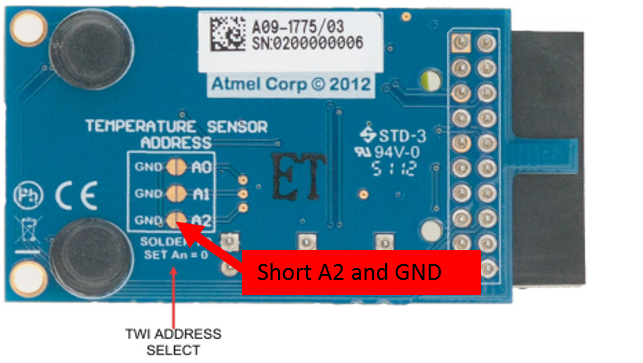
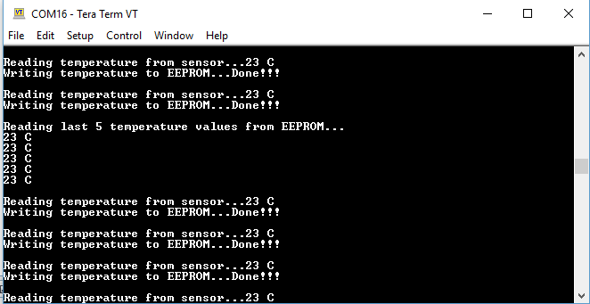

# I2C driver asynchronous - I2C Multi-client

This example application shows how to use multi-client feature of the I2C driver in asynchronous mode to communicate with temperature sensor and an EEPROM.

## Description

Two application tasks are created which act as clients to the same instance of the I2C driver:

APP_I2C_TEMP_SENSOR_Tasks:
- Reads temperature every 1 second, prints on console and notifies the EEPROM client 
- The Time System Service is used to generate a callback every 1 second

APP_I2C_EEPROM_Tasks:
- Writes temperature values to the EEPROM once the temperature read complete notification is received 
- Reads and prints the last five saved temperature data back from the EEPROM when user enters any key on the console.

## Downloading and building the application

To clone or download this application from Github, go to the [main page of this repository](https://github.com/Microchip-MPLAB-Harmony/core_apps_sam_l10_l11) and then click Clone button to clone this repository or download as zip file.
This content can also be downloaded using content manager by following these [instructions](https://github.com/Microchip-MPLAB-Harmony/contentmanager/wiki).

Path of the application within the repository is **apps/driver/i2c/async/i2c_multi_slave/firmware** .

To build the application, refer to the following table and open the project using its IDE.

| Project Name      | Description                                    |
| ----------------- | ---------------------------------------------- |
| sam_l10_xpro.X | MPLABX project for [SAML10 Xplained Pro Evaluation Kit](https://www.microchip.com/DevelopmentTools/ProductDetails/dm320204) |
|||

## Setting up the hardware

The following table shows the target hardware for the application projects.

| Project Name| Board|
|:---------|:---------:|
| sam_l10_xpro.X | [SAML10 Xplained Pro Evaluation Kit](https://www.microchip.com/DevelopmentTools/ProductDetails/dm320204) |
|||

### Setting up [SAML10 Xplained Pro Evaluation Kit](https://www.microchip.com/DevelopmentTools/ProductDetails/dm320204)

- To run the demo, the following additional hardware is required:
  - One [IO1 Xplained Pro Extension Kit](https://www.microchip.com/developmenttools/ProductDetails/ATIO1-XPRO) board
  
  [IO1 Xplained Pro Extension Kit](https://www.microchip.com/developmenttools/ProductDetails/ATIO1-XPRO) Address Select:
  

  - The A2 address line of TWI must be soldered to GND. This is done to modify the address of the the EEPROM on [IO1 Xplained Pro Extension Kit](https://www.microchip.com/developmenttools/ProductDetails/ATIO1-XPRO) 
  - The modification changes the address of the temperature sensor to 0x4B and the EEPROM to 0x50

- Connect [IO1 Xplained Pro Extension Kit](https://www.microchip.com/developmenttools/ProductDetails/ATIO1-XPRO) to EXT1 header

- Connect the Debug USB port on the board to the computer using a micro USB cable

## Running the Application

1. Open the Terminal application (Ex.:Tera term) on the computer
2. Connect to the EDBG Virtual COM port and configure the serial settings as follows:
    - Baud : 115200
    - Data : 8 Bits
    - Parity : None
    - Stop : 1 Bit
    - Flow Control : None
3. Build and Program the application using its IDE
4. Observe the temperature values getting printed on the terminal application every 1 second and temperature value written into EEPROM notification as shown below: 
5. Press any key on the terminal, last 5 temperature values will be read from the EEPROM and displayed as shown below.

    
